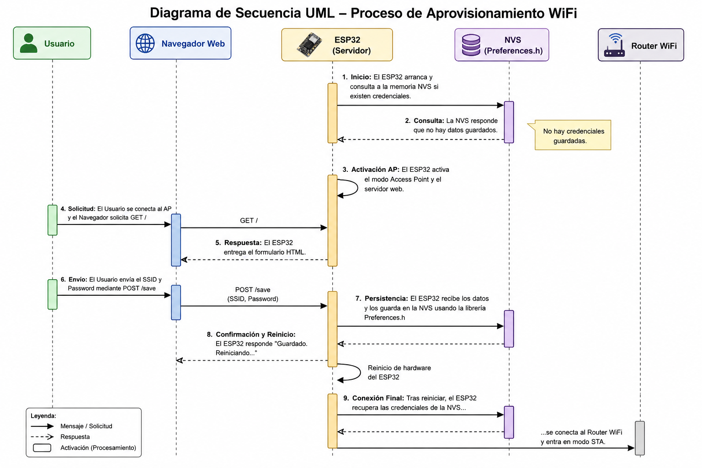
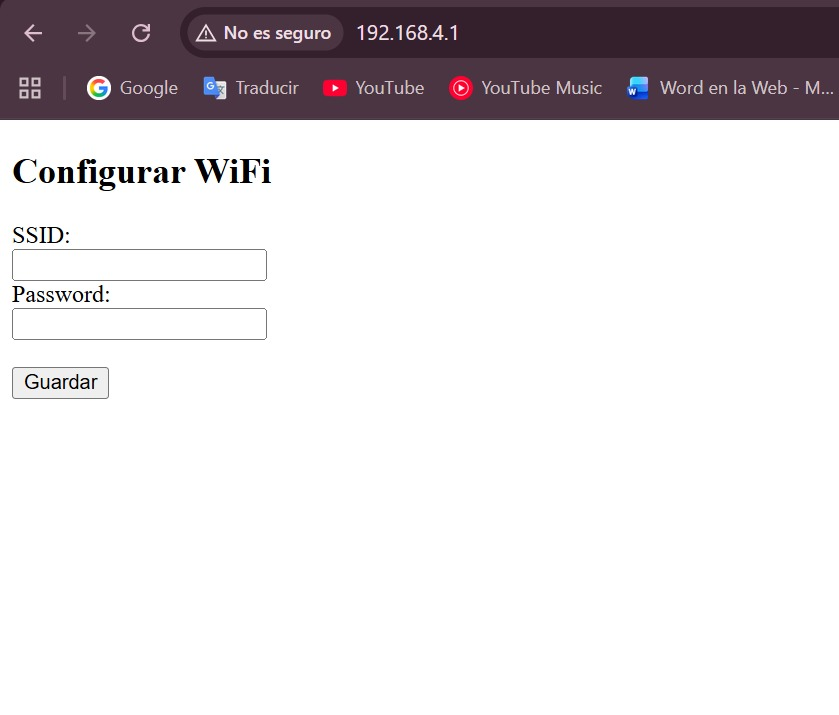

# Aprovisionamiento de Red WiFi con ESP32

Integrantes:
* Jacobo Pacheco
* David Casas
* Yuly Rodríguez

##  Descripción del taller
Este taller implementa una solución IoT basada en el microcontrolador **ESP32** que permite la configuración dinámica de una red WiFi sin necesidad de reprogramar el dispositivo.

El sistema crea un **Access Point (AP)** cuando no existen credenciales guardadas y ofrece una interfaz web para que el usuario configure el SSID y la contraseña. Estas credenciales se almacenan en memoria no volátil y se utilizan automáticamente en futuros arranques.

---

## Objetivos
- Permitir la configuración de WiFi sin reprogramar el ESP32
- Implementar almacenamiento persistente de credenciales
- Desarrollar una interfaz web local amigable
- Garantizar reconexión automática
- Documentar endpoints y pruebas

---

## Tecnologías utilizadas
- ESP32
- Arduino IDE
- Librerías:
  - `WiFi.h`
  - `WebServer.h`
  - `Preferences.h`

---

## Arquitectura del sistema

### Flujo de funcionamiento

1. El ESP32 inicia
2. Verifica si existen credenciales guardadas
3. Si no existen → inicia modo AP
4. Usuario se conecta al AP
5. Accede a la interfaz web
6. Ingresa SSID y contraseña
7. Se guardan en memoria (NVS)
8. El dispositivo reinicia
9. Se conecta automáticamente a la red configurada

---

## Endpoints

### 1. Obtener formulario

- **URL:** `/`
- **Método:** `GET`
- **Descripción:** Muestra formulario de configuración WiFi

#### Respuesta:
200 OK
Contenido HTML

---

### 2. Guardar credenciales

- **URL:** `/save`
- **Método:** `POST`
- **Content-Type:** `application/x-www-form-urlencoded`

#### Body:
ssid=MiRed&password=12345678

#### Respuesta:
200 OK
Guardado. Reiniciando...

---

### 3. Resetear configuración

- **URL:** `/reset`
- **Método:** `GET`

#### Respuesta:
200 OK
Configuracion borrada. Reiniciando...

---

## Pruebas con Postman

### Configuración

- Conectarse a la red: `ESP32_Config`
- URL base: `http://192.168.4.1`

### Requests

#### POST /save
- Body → x-www-form-urlencoded

| Key | Value |
|-----|------|
| ssid | Jacobo |
| password | jacobpac |

#### GET /reset
http://192.168.4.1/reset

---

##  Almacenamiento
Se utiliza `Preferences.h` (NVS) para almacenar:
- SSID
- Password

Esto permite persistencia incluso después de reinicios.

---

##  Reconexión automática
El sistema intenta conectarse automáticamente al iniciar:

- Si la conexión es exitosa → modo STA
- Si falla → vuelve a modo AP

---

##  Mecanismo de Reset

El sistema permite borrar la configuración mediante:

- Endpoint `/reset`
- (Opcional) botón físico

---
## Evidencia de práctica

##  Validación funcional

### Escenario 1: Primera ejecución
- ESP32 crea red WiFi
- Usuario accede a 192.168.4.1
- Configura red

### Escenario 2: Reinicio
- ESP32 se conecta automáticamente

### Escenario 3: Error de conexión
- ESP32 vuelve a modo AP

## Preguntas de situación

## ¿Es posible conectarse a redes WIFI con seguridad PEAP Enterprise con el ESP32? ¿Qué se necesita?
Es posible, aunque es un poco más complejo. Pues se trata de una red a la que no se accede por una contraseña compartida, sino con unas credenciales a travez de un servidor RADIUS. Para eso, con la ESP32 necesitamos tener la librería "esp_wpa2.h"; además de que, con la red, será necesario tener un usuario, contraseña, certificado CA del servidor RADIUS (opcional pero recomendado para validar el servidor), y una identidad anónima (si la red la requiere).

## ¿Cuántas conexiones/clientes simultáneos soporta la librería WebServer? ¿Qué alternativas hay? 
El máximo de sockets abiertos en la ESP32 es 13, pero la librería "WebServer" en la práctica es mucho más restrictiva porque bloquea el hilo mientras atiende cada petición. Si llega una segunda solicitud mientras atiende la primera, simplemente espera. Esto la hace inadecuada para más de 1 a 2 clientes simultáneos reales.

## Comparar la cantidad de memoria Flash usada por su implementación contra el ejemplo "Basic" de la librería WiFiManager.
- Nuestra implementación
938112 bytes (71%) — programa
46976 bytes  (14%) — variables globales

- Ejemplo Básico de WifiManager
1020872 bytes (77%) — programa
46752 bytes  (14%) — variables globales

- Análisis
Se puede evidenciar incremento de uso de memoria con el ejemplo básico de WifiManager. Esto sucede debido a que esta arrastra a otras librerías internamente. Maneja el DNS server, la lógica del portal cautivo, y la detección automática en distintos sistemas operativos. Lo cual ocupa más memoria al guardar el programa.

Por otro lado, la diferencia de uso de RAM (las variables globales) es mínima (casi imperceptible). Ya que ambas formas de Wifi usan las mismas estructuras de datos en RAM.

---
